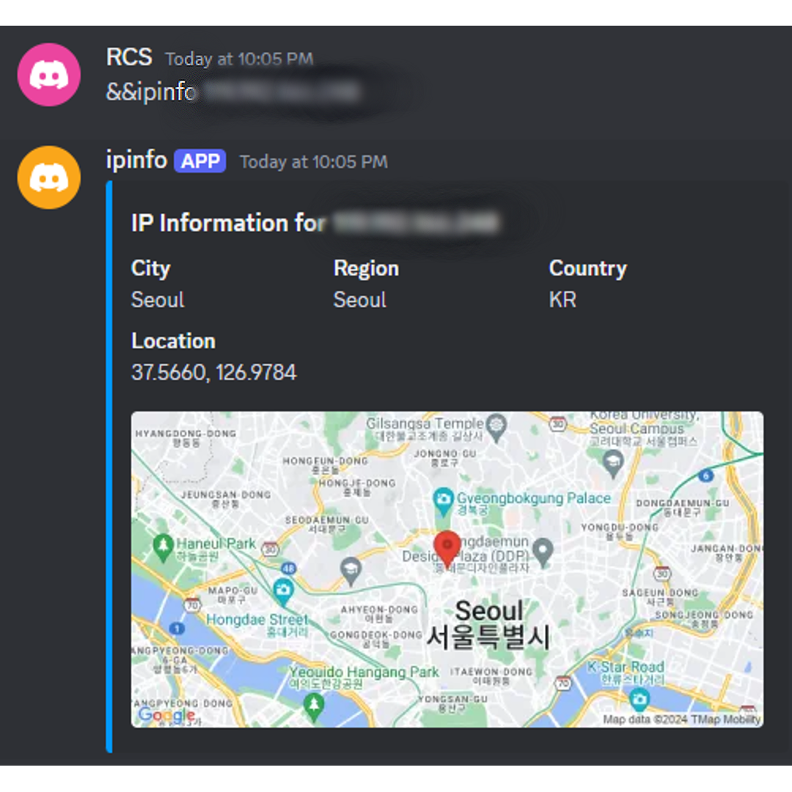

    <h1>Discord Ip Info Finder</h1>
    
    
     
     
    

## Feature
- IP info
    - City
    - Region
    - Country
    - Location
    - Map Image

## Install

### Setup
1. [Download source code zip](https://github.com/RealRCS/Discord_Ipinfo_Finder/archive/refs/heads/main.zip)
2. Extract zip
3. Edit `.env`
4. Run `setup.bat`
5. Run `start.bat`

## How to use
Send `&&ipinfo <ip>`

## Run Example

    </img>

## License

This Bot is licensed under the <a href="https://mit-license.org/">MIT License</a>.
